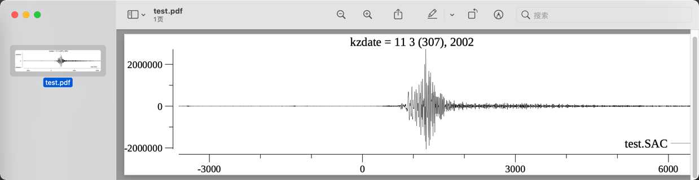

# sacgo

a go program read SAC(Seismic Analysis Code) file

Features
========

- Cross-platform
- Simple
- REPL like SAC soft

Document
========

[中文](doc/README_cn.md)

Examples
=======

Supported Command
========

- r (read)
- p (plot, plot1, plot2)
- w (write)
- k (kill q quit)
- lh
- ls

Thanks
========

[***Liner***](https://github.com/peterh/liner)

[***plot***](https://github.com/gonum/plot)