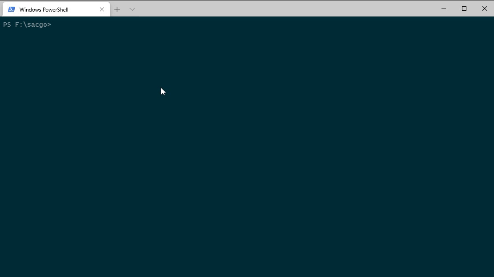
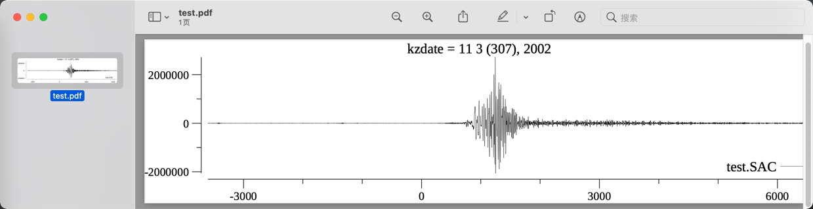

# sacgo

一个go程序解析SAC(Seismic Analysis Code)文件

特性
========

- 跨平台
- 上手简易

例子
=======

支持的命令
========

- r (read)
- p (plot, plot1)
- w (write)
- k (kill q quit)
- lh
- ls

感谢
========

[***Liner***](https://github.com/peterh/liner)

[***plot***](https://github.com/gonum/plot)